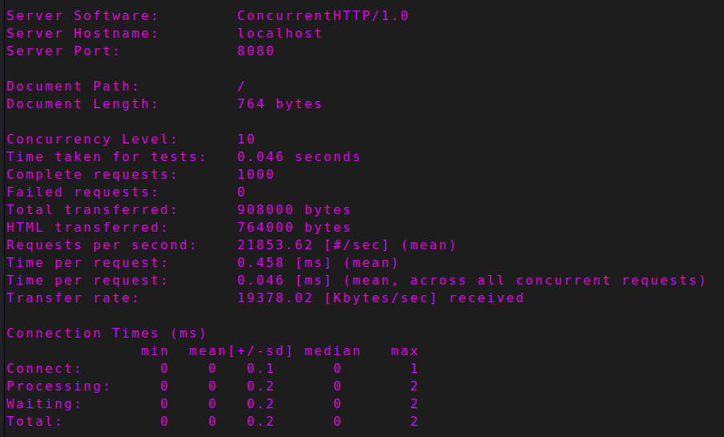
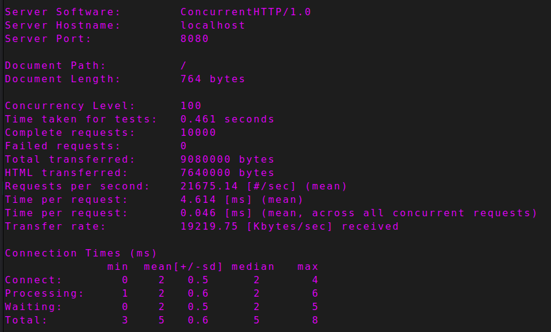
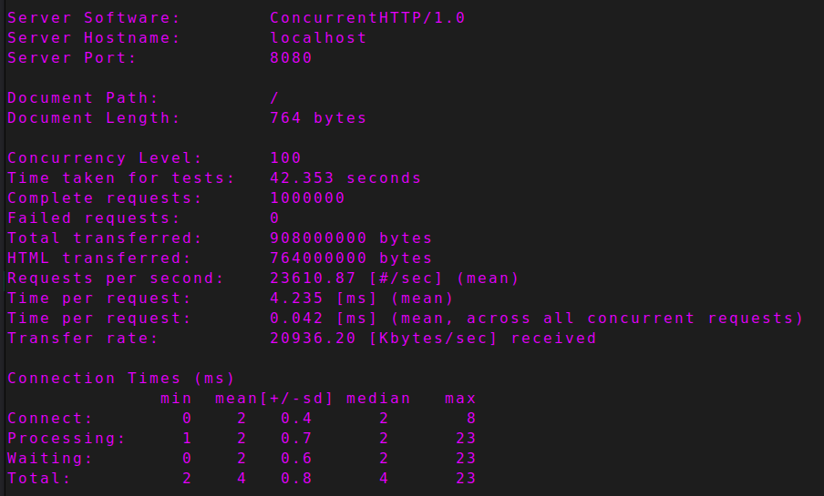
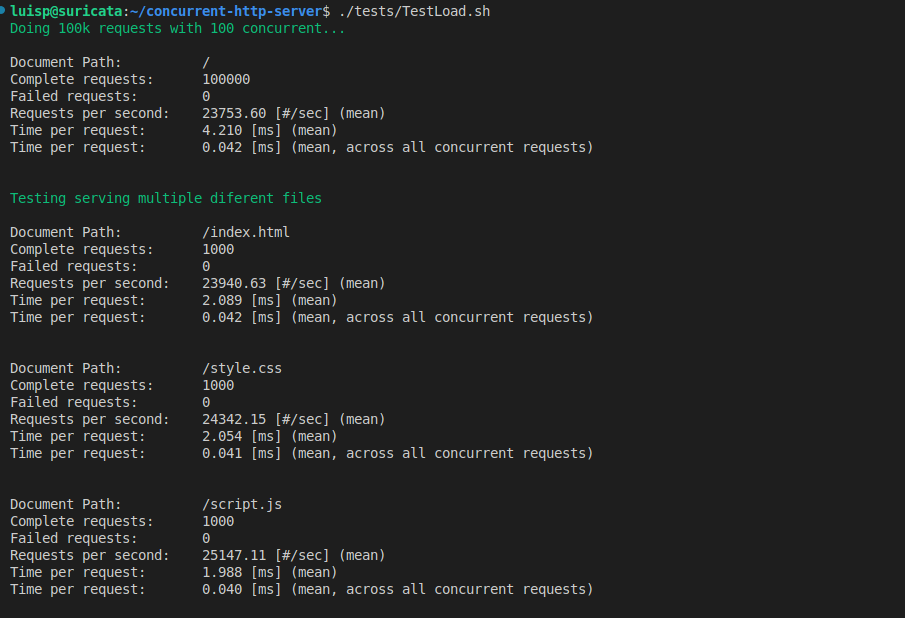
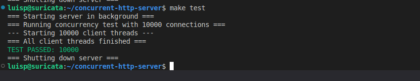
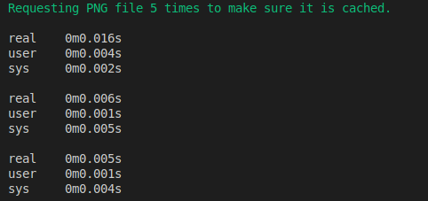
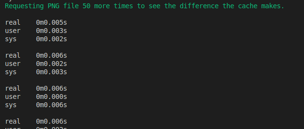

# Testing for the Multi Threaded Multi Process Web Server Project

## AUTHORS

Luís Pedro Costa Néri Correia NMEC 125264<br>
Guilherme Mendes Martins NMEC 125260


## LOAD TESTING

To load test the server we made a shell script that uses the ab command to make 100 000 requests with 100 concurrent. After executing it prints the number of failed requests, the number of requests per second and the time per request.<br>

Now, to use the file first check if it has the permissions needed or just use ```chmod u+x tests/TestLoad.sh```.<br>
Then start the server with the make option you deem better for simplicity's sake we'll use ```make run```.<br>
After the server starts running in another terminal run ```./tests/TestLoad```.

<h3> First simpler tests will be made (the ones present in the guide) then the shell script will be used to test the program<h3>

### TEST CASE 1: Basic load test (1000 requests, 10 concurrent)
**Objective:** Verify the server can withstand small amounts of load<br>
**Steps**
1. Run the server with ```make run``` or another option in the Makefile
2. In another terminal run ```ab -n 1000 -c 10 http://localhost:8080/```<br>

**Expected result:**
- All requests are answered in a reasonable amount of time
- Server sends the correct data<br>

**Actual result:**
- All requests were answered in a timmely manner
- Server sent the right data<br>

**Status:** 🗹 Pass ☐ Fail<br>
**Screenshots:** <br>


### TEST CASE 2: High concurrency test (10000 requests, 100 concurrent)
**Objective:** Verify the server can withstand a higher load with more concurrent requests.
**Steps**
1. Run the server with ```make run``` or another option in the Makefile
2. In another terminal run ```ab -n 10000 -c 100 http://localhost:8080/```<br>

**Expected result:**
- All requests are answered in a reasonable amount of time
- Server sends the correct data<br>

**Actual result:**
- All requests were answered in a timmely manner
- Server sent the right data<br>

**Status:** 🗹 Pass ☐ Fail<br>
**Screenshots:** <br>


### TEST CASE 3: Sustained load test
**Objective:** Verify the server can hold itself up when under load for a bigger amount of time.
**Steps**
1. Run the server with ```make run``` or another option in the Makefile
2. In another terminal run ```ab -t 300 -n 1000000 -c 100 http://localhost:8080/```
> Here we are using -t 300 to timeout after 300 seconds and setting the number of requests to 1000000 to have it run for longer.<br>
> The reason we set -n to 1000000 is because if you do not specify -n it will be set to 50 000 and that does not stress test the "server" for long enough<br>

**Expected result:**
- Server can handle all requests and does not crash when running for longer periods of time
- Server sends the correct data<br>

**Actual result:**
- Server handled all requests and did not crash when running a longer period of time
- Server sent the right data<br>

**Status:** 🗹 Pass ☐ Fail<br>
**Screenshots:** <br>


### TEST CASE 4: TestLoad.sh
**Objective:** Verify the server passes the TestLoad.sh tests.
**Steps**
1. Run the server with ```make run``` or another option in the Makefile
2. In another terminal run ```./tests/TestLoad.sh```

**Expected result:**
- There are no failed requests.
- Server answers all requests in a reasonable amount of time.<br>

**Actual result:**
- There were no failed requests.
- Server answered all requests in a reasonable amount of time.<br>

**Status:** 🗹 Pass ☐ Fail<br>
**Screenshots:** <br>


## CONCURRENCY TESTING

For the concurrency tests we will use a C programs instead of a shell script, so to run these tests there is a Makefile configuration ```make test```.<br>
Upon running it both the server and the tests should start.

Running ```make test``` starts the server in the background with ```./$(TARGET) > /dev/null 2>&1 &``` and redirects all it's output to /dev/null.<br>
Making it so it does not appear in the terminal.
Then the program waits ```sleep 1``` and finally runs the TestConcurrency.c program.<br>
In the end the output of TestConcurrency is shown in the terminal and it kills the server's process.

### TEST CASE 5: TestConcurrency.c
**Objective:** Verify the server can handle a lot of concurrent requests.
**Steps**
1. Run the server with ```make test```

**Expected result:**
- There are no failed requests.
- Server answers all requests in a reasonable amount of time.<br>

**Actual result:**
- There were no failed requests.
- Server answered all requests in a reasonable amount of time.<br>

**Status:** 🗹 Pass ☐ Fail<br>
**Screenshots:** <br>


## PERFORMANCE TESTING

The performance tests have a small shell script dedicated to checking the cache effectiveness.<br>
So to run this performance test please use ```chmod u+x tests/TestPerformance.sh``` to give the user execution permissions.<br>
Then start a server instance with ```make run``` or another suitable make configuration available.<br>
After the server is running use the test script ```./tests/TestPerformance.sh```.

### TestPerformance.sh

The script first runs the command ```time curl -s http://localhost:8080/diamond.png > /dev/null``` 5 times.<br>
In theory and as we will see it only needs to be used once but to make sure the file is cached in all processes we run it 5 times.<br>



The result is a time elapsed of .016 seconds for the first request. This is beacuse the file was not cached and so the program had to read all the file's information to serve it.<br>



After the first 5 requests to cache the file, 50 more are made to see if the performance improved when serving cached files.<br>
As it is possible to see in the image above, there was a significant decrease in the time spent per request, roughly a 68% decrease in time spent per request.<br>

**For more information on performance please do check the Technical Report pdf present in the docs folder.**